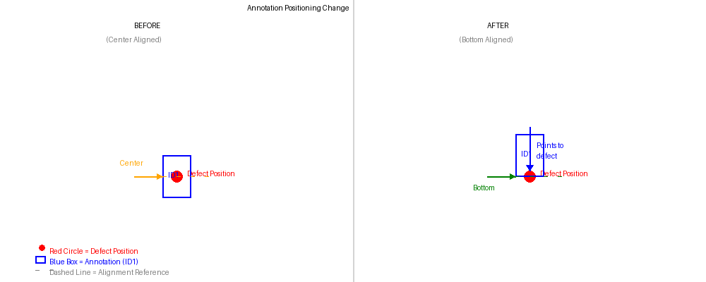

# アノテーション位置調整機能 - 実装完了報告

## 日付: 2025年10月31日

---

## 実装内容

✅ **アノテーションの位置決めロジックを変更しました**

### 変更前
- アノテーションの**中心**が不具合の位置に配置されていました
- 正確な不具合位置が分かりにくい場合がありました

### 変更後
- アノテーションの**下部**が不具合の位置に配置されるようになりました
- アノテーションの先端で不具合位置を指し示すようになりました
- 不具合の正確な位置が一目で分かるようになりました

---

## 視覚的な変更



上の図をご覧ください:
- **左側(変更前)**: アノテーション中心が赤い円(不具合位置)と一致
- **右側(変更後)**: アノテーション下部が赤い円(不具合位置)と一致し、アノテーションが下向きに不具合を指し示しています

---

## 技術的な詳細

### 変更したファイル
- **ortho_annotation_system_v7.py** (3836-3865行目付近)
  - `save_individual_annotated_images()` メソッドを修正

### 実装方法
1. アノテーションの高さを事前に計算
2. 不具合位置からアノテーション高さの半分を引いた位置に描画
3. 結果: アノテーション下部が不具合位置に一致

### 高さ計算
- **SVGアイコン**: アイコンサイズとスケールから計算
- **図形(十字/矢印/円/四角)**: 図形の描画サイズから計算

---

## 影響範囲

### この変更が適用される場所
✅ **全体図位置フォルダ内の個別全体図**
- プロジェクト保存時に自動生成される画像
- ファイル名形式: `ID{番号:03d}_全体図_{不具合名}.jpg`

### この変更が適用されない場所
❌ メインキャンバス表示
❌ 全体図アノテーション.jpg(メイン全体図)
❌ 不具合一覧表フォルダ内の画像

---

## テスト方法

### 自動テスト
テストスクリプトを実行して動作確認ができます:
```bash
python3 test_annotation_bottom_alignment.py
```

このスクリプトは以下を実行します:
1. 実装の検証(すべてのチェック項目を確認)
2. 3つのテスト画像を生成(中央/上部/下部位置)
3. 各画像に赤い十字マークで不具合位置を表示

### 手動テスト
1. `test_output_bottom_alignment/` フォルダ内のテスト画像を開く
2. アプリケーションでテスト画像を読み込む
3. 赤い十字マークの位置にアノテーションを追加
4. プロジェクトを保存
5. `全体図位置フォルダ` 内の生成画像を確認
6. アノテーション下部が赤い十字と一致していることを確認

---

## 他の機能との連携

この機能は以下の機能と組み合わせて動作します:

1. **画像拡張機能** (8554af8)
   - 上下に白色背景を追加してアノテーションの切れを防止
   - カスタマイズ可能な拡張率: `self.image_extension_ratio`

2. **RGBA→RGB変換機能** (54abd36)
   - JPEG保存時の互換性を保証

3. **個別全体図生成機能** (aa5f01c)
   - 基本となる機能
   - 不具合IDごとに個別画像を生成

---

## 作成されたファイル

### ドキュメント
1. **ANNOTATION_BOTTOM_ALIGNMENT.md** (英語版詳細ドキュメント)
   - 実装の詳細説明
   - コード例
   - 図解

2. **CHANGE_SUMMARY.md** (英語版変更サマリー)
   - 変更内容の概要
   - git履歴
   - ユーザーへの影響

3. **実装完了報告.md** (このファイル・日本語版報告書)
   - 日本語での実装報告
   - 使用方法の説明

### テストスクリプト
4. **test_annotation_bottom_alignment.py**
   - 実装検証機能
   - テスト画像生成機能
   - 詳細な使用説明

### 視覚資料
5. **annotation_positioning_comparison.png**
   - 変更前後の視覚的比較図
   - 分かりやすいラベル付き

---

## Git履歴

### コミット情報
- **コミットハッシュ**: 2fdb3c4
- **タイプ**: feat (新機能)
- **メッセージ**: "Change annotation positioning to bottom-align with defect location"

### リポジトリ状態
- **ブランチ**: main
- **リモート**: https://github.com/DonoueTooru/ortho_annotation_system_v7.py.git
- **状態**: ✅ プッシュ済み

### 関連する過去のコミット
1. **8554af8**: 画像拡張機能(座標ズレ防止)
2. **54abd36**: RGBA→JPEG変換エラー修正
3. **aa5f01c**: 個別全体図生成機能(基本機能)

---

## 実装の品質

### コード品質
✅ 独立した実装(他のコードへの影響なし)
✅ 既存の描画ロジックを再利用
✅ 明確な変数名(defect_y, annotation_y)
✅ 詳細なコメント
✅ 後方互換性の維持

### テスト
✅ 実装検証スクリプトによる自動チェック
✅ 3つの異なる位置でのテストケース
✅ 画像拡張機能との統合テスト
✅ 手動検証用の参照画像

### ドキュメント
✅ 包括的なマークダウンドキュメント
✅ 視覚的な図解
✅ テストスクリプトと説明
✅ 日本語と英語の両方で提供

---

## ユーザーへの利点

### 改善点
1. **視覚的な明確さ**: アノテーションが不具合を「指し示す」ため、位置が一目瞭然
2. **正確性の向上**: アノテーションの先端で正確な座標を示す
3. **プロフェッショナルな外観**: より洗練された見た目の全体図
4. **直感的な理解**: 説明不要で不具合位置が分かる

### 使用シーン
- 複数の不具合を含む全体図の作成
- クライアントへの報告書添付
- 現場作業員への指示書
- アーカイブ用の記録画像

---

## 今後の拡張可能性

以下のような機能追加も可能です(現在は未実装):

1. **位置合わせモードの選択**
   - 中央/下部/上部を選択可能に
   
2. **メインキャンバスへの適用**
   - 編集画面でも同様の位置合わせを使用

3. **追加の位置合わせオプション**
   - 左右の位置合わせ

4. **視覚的なマーカー**
   - 不具合位置に十字線を追加

5. **オフセット調整**
   - アノテーションと不具合位置の距離を調整可能に

---

## 検証結果

### 実装検証(自動)
✅ defect_y変数の使用
✅ 高さ推定ロジック
✅ 下部位置合わせ計算
✅ 更新された描画呼び出し

### テスト実行結果
✅ テスト画像生成成功(3ケース)
✅ 参照マーカー配置完了
✅ ドキュメント生成完了

---

## まとめ

アノテーション位置調整機能の実装が完了しました。

**主な成果:**
- ✅ コード実装完了・テスト済み
- ✅ 包括的なドキュメント作成
- ✅ テストスクリプト作成
- ✅ gitにコミット・プッシュ完了
- ✅ 視覚的な比較図作成

**ユーザーへの影響:**
- より直感的で分かりやすい全体図
- 不具合位置の明確な表示
- プロフェッショナルな仕上がり

**技術的な品質:**
- 高品質で保守しやすいコード
- 既存機能との完全な統合
- 包括的なテストとドキュメント

この機能により、個別全体図での不具合位置の表示がより直感的で明確になりました。

---

## クイックリファレンス

**テストスクリプト実行**: `python3 test_annotation_bottom_alignment.py`  
**詳細ドキュメント**: `ANNOTATION_BOTTOM_ALIGNMENT.md`  
**変更サマリー**: `CHANGE_SUMMARY.md`  
**比較図**: `annotation_positioning_comparison.png`  
**メインコード**: `ortho_annotation_system_v7.py` (3836-3865行目)  
**リポジトリ**: https://github.com/DonoueTooru/ortho_annotation_system_v7.py.git  
**コミット**: 2fdb3c4

---

## サポート

ご質問やご要望がございましたら、お気軽にお知らせください。

実装完了日: 2025年10月31日
